# Linux期末整理

---

## 1 认识*Linux*

1. #### 知道Linux的历史发展和版本，linux是谁写的？

   > Linux诞生于`1991`年，由芬兰赫尔辛基大学的学生`Linus Torvalds`在自己的Intel386个人计算机上开发，利用Internet发布了他开发的源代码，和后来陆续加入的众多爱好者共同完成，Linux是一个开源软件。

2. #### 了解Linux的特点

   > 1. 自由软件，源码公开
   > 2. 配置要求低廉
   > 3. 功能强大而稳定
   > 4. 独立工作

3. #### 目前市场上有哪些linux版本?

    > 国外
    >1. Red Hat Linux
   > 2. CentOS Linux
   > 3. Debian Linux
   > 4. Ubuntu Linux
   > 5. Fedore Linux
   > 6. Arch Linux

   > 国内  
   >1. 红旗Linux
   >2. 中标普华Linux
   >3. 共创桌面Linux
   >4. 冲浪Linux

## 6 Linux的文件权限与目录配置

1. #### 了解用户的身份和权限

   > 三种身份：`owner`	`group`	`others`
   >
   > 三个权限：`read`	`write`	`execute`

2. #### 掌握设置文件文件和目录的权限（chown chgrp chmod)

    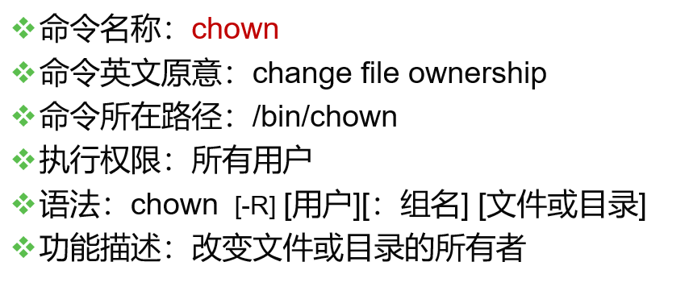
   
    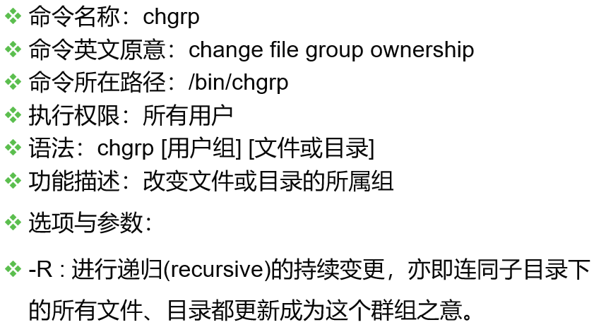
   
    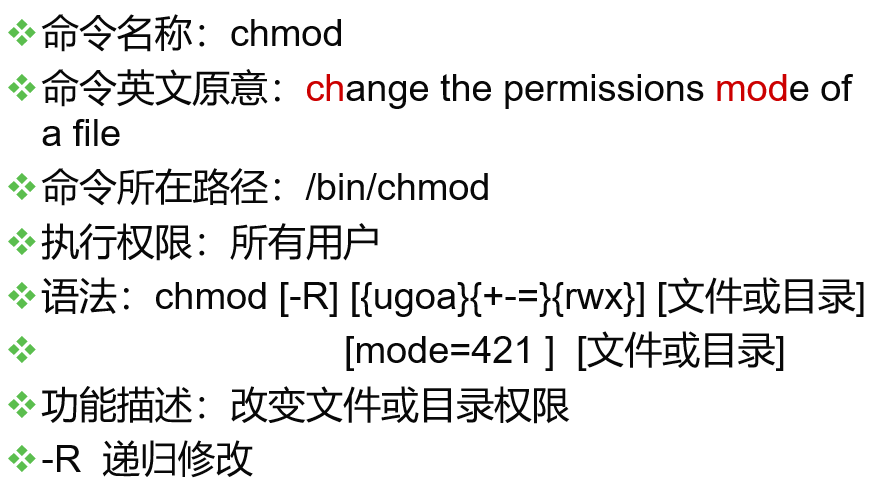

3. #### 例： 若有一个文件的类型与权限数据为“-rwxr-xr--”，请说明其意义？

   > [-]  [rwx]  [r-x]  [r--] 
   >
   > 1   234   567   890 
   >
   > 1 为：代表这个文件名为目录或文件，本例中为文件(-) 
   >
   > 234为：拥有者的权限，本例中为可读、可写、可执行(rwx) 
   >
   > 567为：同群组用户权力，本例中为可读可执行(rx)
   >
   > 890为：其他用户权力，本例中为可读(r)

4. #### 例：假设test1, test2, test3同属于testgroup这个群组，如果有下面的两个文件，请说明两个文件的拥有者与其相关的权限为何？

    -rw-r--r-- 1 root root 238 Jun 18 17:22 test.txt
    -rwxr-xr-- 1 test1 testgroup 5238 Jun 19 10:25 ping_tsai
   > - 文件test.txt的拥有者为root，所属群组为root。只有root这个账号可以存取此文件，其他人则仅能读此文件；
   >
   > - 文件ping_tsai的拥有者为test1，而所属群组为testgroup。
   >
   >   1.test1 对此文件具有可读可写可执行的权力；
   >
   >   2.而同群组的test2, test3两个人与test1同样是testgroup的群组账号，则仅可读可执行但不能写(亦即不能修改)；
   >
   >   3.非testgoup这一群组的人则仅可以读，不能写也不能执行！

5. #### 如果我的目录为如下的样式，请问testgroup这个群组的成员与其他人(others)是否可以进入本目录？

   drwxr-xr-- 1 test1 testgroup 5238 Jun 19 10:25 groups/

   > - 文件拥有者test1[rwx]可以在本目录中进行任何工作；
   >- testgroup这个群组[r-x]的账号，例如test2, test3亦可以进入本目录进行工作，但是不能在本目录下进行写入；
   > - other的权限中[r--]虽然有r ，但是由于没有x的权限，因此others的使用者，并不能进入此目录！
   
    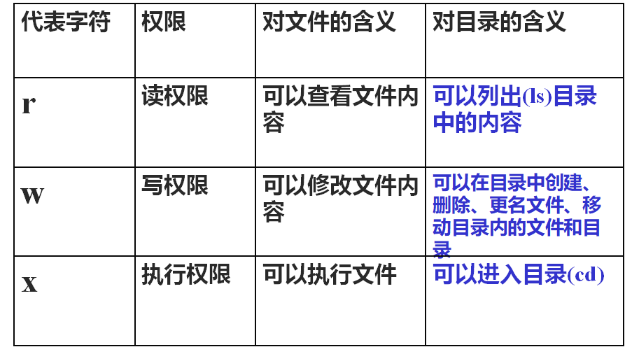

6. #### 范例：增加.bashrc文件权限，使每个人均可写入

   > 在.bashrc所在位置下执行`chmod a+w .bashrc` 
   >
   > `a`代表所有用户即拥有者，群组，其他用户
   >
   > `+w`代表加上写权限

7. #### 范例：假设有个账号名称为dmtsai，他的家目录在/home/dmtsai/，dmtsai对此目录具有[rwx]的权限。 若在此目录下有个名为the_root.data的文件，该文件的权限如下： 

   -rwx------ 1 root root 4365 Sep 19 23:20 the_root.data 
   
   请问dmtsai对此文件的权限为何？可否删除此文件？

     > 由于dmtsai对此文件来说是『others』的身份，因此这个文件他无法读、无法编辑也无法执行，
     > 也就是说，他无法变动这个文件的内容。 

     > 但是由于这个文件在他的家目录下，他在此目录下具有rwx的完整权限，因此对于the_root.data这个『文件名』来说，他是能够『删除』的！
     > 结论就是，dmtsai这个用户能够删除the_root.data这个文件！

8. #### 范例： 我想在 /tmp 下面建立一个目录，这个目录名称为 chapter7_1 ，并且这个目录拥有者为 dmtsai， 群组为 users ，此外，任何人都可以进入该目录浏览文件，不过除了 dmtsai 之外，其他人都不能修改该目录下的文件。

     > 建立目录： mkdir   /tmp/chapter7_1 
     >
     > 修改属性： chown   -R   dmtsai:users   /tmp/chapter7_1 
     >
     > 修改权限： chmod   -R   755   /tmp/chapter7_1

 9. 
     >文件的预设属性是：-rw-rw-rw-
     >
     >目录的预设属性是：drwxrwxrwx
     >
     >umask 指定的是『该默认值需要减掉的权限！』
     >
     > 建立文件时： (-rw-rw-rw-) – (-----w--w-) ==> -rw-r--r--
     >
     > 建立目录时： (drwxrwxrwx) – (d----w--w-) ==> drwxr-xr-x

10. #### 范例三：假如 dmtsai 是 users 这个群组的人，而 dmtsai 的文件希望让 users 同群组的人也可以存取， 这也是常常被用在团队开发计划时，常常会考虑到的权限问题。

      > umask   002
      >
      > touch   test3
      >
      > mkdir  test4
      >
      >  ll -d test3 test4
      >
      > -rw-rw-r-- 1 root root 0 Jul 20 00:41 test3
      >
      > drwxrwxr-x 2 root root 4096 Jul 20 00:41 test4

## 7 Linux的文件与目录管理

1. #### 掌握以下命令：

      - pwd
        > 绝对路径方式显示用户当前工作目录
        > -P ：显示出确实的路径，而非使用链接 (link) 路径。
      - ls
        > 显示目录内容列表
        >
        > -a, --all # 列出目录中所有文件，包括以“.”开头的文件
        >
        > **文件名的开头为小数点『.』时， 代表这个文件为『隐藏文件』**
        >
        > -l          #显示不隐藏的文件与文件夹的详细信息
        >
        > -al  #显示当前目录下的所有文件及文件夹包括隐藏的.和..等的详细信息  
      - cd
        > 切换目录
        > > cd    # 进入用户主目录；
        > > cd ~  # 进入用户主目录；
        > > cd ..  # 返回上级目录（若当前目录为“/“，则执行完后还在“/"；".."为上级目录的意思）；

      - mkdir
        > 用来创建目录,多个目录之间用空格隔开。  
        > -p或--parents 若所要建立目录的上层目录目前尚未建立，则会一并建立上层目录；

      - rmdir
        
        > 用来删除空目录
      - rm
        > 用于删除给定的文件和目录
        > > -f ：force ，强制执行  
        > > -i ：在删除前会询问使用者是否操作 
        > > -r ：递归删除，常用于目录的删除，这是非常危险的选项！

      - mv
        > 用来对文件或目录重新命名
        > 注：mv与cp的结果不同，mv好像文件“搬家”，文件个数并未增加。而cp对文件进行复制，文件个数增加了。
        > > -f ：force 强制的意思，如果目标文件已经存在，不会询问而直接覆盖；  
        > > -i ：若目标文件 (destination) 已经存在时，就会询问是否覆盖！  
        > > -u ：若目标文件已经存在，且 source 比较新，才会更新 (update)
      - cp
         > 将源文件或目录复制到目标文件或目录中
         > > -i ：若目标文件已经存在时，在覆盖时会先询问操作的进行(常用)  
         > > -l ：进行硬式连结(hard link)的连结文件建立，而非复制文件本身；  
         > > -s ：复制成为符号链接文件 ，亦即『快捷方式』文件；  
         > > -p ：连同文件的属性一起复制过去，而非使用默认属性(备份常用)；  
          > > -r ：递归持续复制，用于目录的复制行为；(常用)
      - more/less  
        > `more`显示文件内容，每次显示一屏
        > > 空格键 (space)：代表向下翻一页；  
        > > Enter ：代表向下翻『一行』；  
        > > /字符串 ：代表在这个显示的内容当中，向下搜寻『字符串』这个关键 词；  
        > `less`分屏上下翻页浏览文件内容  
        > **less命令** 的作用与more十分相似，都可以用来浏览文字档案的内容，不同的是less命令允许用户向前或向后浏览文件，而more命令只能向前 浏览。用less命令显示文件时，用PageUp键向上翻页，用PageDown键向下 翻页。要退出less程序，应按Q键。
      - cat/tac  
         > **cat命令** 连接文件并打印到标准输出设备上，cat经常用来显示文件的内容.
         > **tac命令** 用于将文件以行为单位的反序输出，即第一行最后显示，最后一行先显示。
         >
         > > 例：
         > > `cat m1` （在屏幕上显示文件m1的内容）
        > > `cat m1 m2` （同时显示文件m1和m2的内容）
        > > `cat m1 m2 > file` （将文件m1和m2合并后放入文件file中）
      - touch
        > 创建新的空文件
        > **touch命令** 有两个功能：一是用于把已存在文件的时间标签更新为系统当前的时间（默认方式），它们的数据将原封不动地保留下来；二是用来创建新的空文件。
      - head/tail
        >`head`在屏幕上显示指定文件的开头若干行
        >用于显示文件的开头的内容。在默认情况下，head命令显示的头10行内容。
        >> -n<数字>：指定显示头部内容的行数；
        >> -c<字符数>：指定显示头部内容的字符数；
        > `tail`在屏幕上显示指定文件的末尾若干行
        > > `tail file` #（显示文件file的最后10行）
        > > `tail -n +20 file` #（显示文件file的内容，从第20至文件末尾）
        > > `tail -c 10 file` #（显示文件file的最后10个字符）
        > > `tail -25 mail.log` # 显示 mail.log 最后的 25 行
      - find
        > 在指定目录下查找文件
        > > 将目前目录及其子目录下所有延伸档名是 c 的文件列出来。
        > > `find . -name "*.c"`
      - grep
        > 它能使用正则表达式搜索文本，并把匹配的行打印出来。滤/搜索的特定字符。

        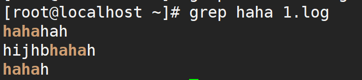

2. #### 绝对路径与相对路径 

    >  绝对路径：**由根目录(/)开始写起的文件名或目录名称， 例如 /home/dmtsai/.bashrc；**  
    >  相对路径：**相对于目前路径的文件名写法。例如 ./home/dmtsai或../../home/dmtsai/ 等等**

    > `.` ：代表当前的目录，也可以使用 ./ 来表示；
    > `..` ：代表上一层目录，也可以 ../ 来代表。  

3. #### 假如我想要显示 /etc/man_db.conf 的第 11 到第 20 行,怎么实现？ 

    ```shell
    head -n  20  /etc/man_db.conf  |  tail -n  10
    ```
    
4. #### 什么是软链接与硬链接？如何创建    
    > `软链接`文件有类似于Windows的快捷方式。它实际上是一个特殊的文件。在符号连接中，文件实际上是一个文本文件，其中包含的有另一文件的位置信息。
    >
    > `硬连接`的作用是允许一个文件拥有多个有效路径名，这样用户就可以建立硬连接到重要文件，起到防止“误删”的功能

    > ln  -s  bashrc  bashrc_slink   #创建软链接
    >   ln   bashrc  bashrc_hlink   #创建硬链接
>
    > cp -s bashrc bashrc_slink   #创建软链接
    >   cp -l bashrc bashrc_hlink   #创建硬链接

5. #### 在Linux中隐藏文件有什么特点？如何查看隐藏文件？

      >  开头为. 的文件
      >
      > `ls -a`全部的文件，连同隐藏文件( 开头为. 的文件) 一起出来  

6. #### 使用rmdir命令来删一个目录，但无法成功，请说明可能的原因和可解决的方法
     > 目录不为空
     >
     > 可用`rm -rf`来删除

## 8 Linux的文件系统

1. #### 主分区、扩展分区与逻辑分区如何划分，以及对应的设备文件名

   > **主分区：**总共最多只能分四个
   >
   > **扩展分区：**只能有一个，也算作主分区的一种，也就是说主分区加扩展分区最多有四个。但是扩展分区不能存储数据和格式化，必须再划分成逻辑分区才能使用。
   >
   > **逻辑分区：**逻辑分区是在扩展分区中划分的，如果是IDE硬盘，Linux最多支持58个逻辑分区，如果是SCSI硬盘Linux最多支持11个逻辑分区
   
   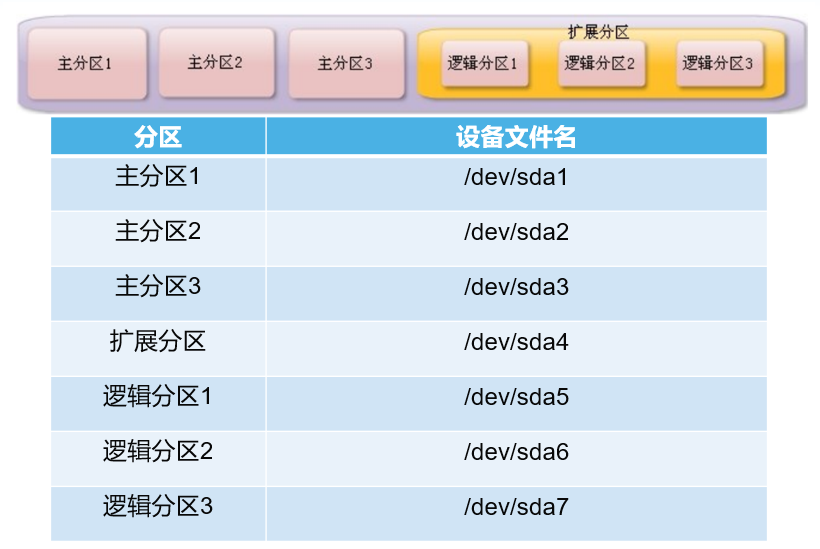
   
   
   
2. #### df

   > **文件系统查看命令**
   >
   > df [选项] [挂载点]
   >
   > > -a 显示所有的文件系统信息，包括特殊文件系统，如/proc、/sysfs
   > >
   > > -h 使用习惯单位显示容量，如KB，MB或GB等
   > >
   > > -T 显示文件系统类型
   > >
   > > -m 以MB为单位显示容量
   > >
   > > -k 以KB为单位显示容量。默认就是以KB为单位

3. #### du

   > **统计目录或文件大小**
   >
   > du [选项] [目录或文件名]
   >
   > > -a 显示每个子文件的磁盘占用量。默认只统计子目录的磁盘占用量
   > >
   > > -h 使用习惯单位显示磁盘占用量，如KB，MB或GB等
   > >
   > > -s 统计总占用量，而不列出子目录和子文件的占用量

4. #### 掌握挂载与卸载光盘的过程

   > 1、挂载光盘
   >
   > `mkdir /mnt/cdrom/`
   >
   > `mount /dev/sr0 /mnt/cdrom/`
   >
   > 2、卸载命令
   >
   > umount 设备文件名或挂载点
   >
   > `umount /mnt/cdrom`

## 9文件与文件系统的压缩与打包

### 1.压缩指令

#### 1.gzip
   > 语法：gzip [文件]
    > 压缩后文件格式：`.gz`
    > 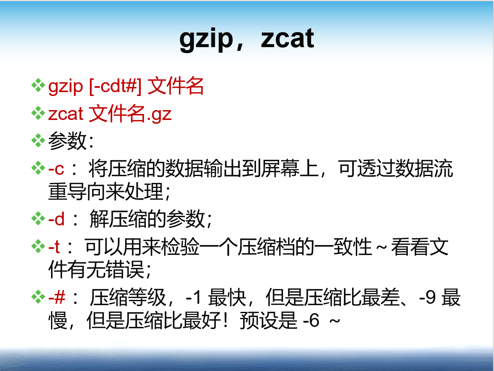

#### 2.bzip2

> 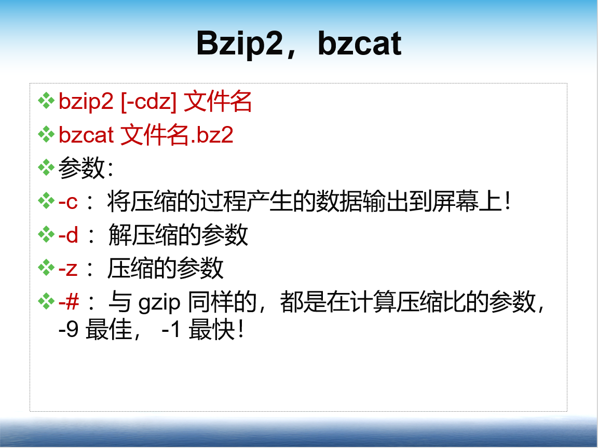

#### 3.tar

> 语法：tar [-zcf] [压缩后文件名] [目录]
>
> 功能描述：`.tar.gz`
>
> > -c 打包
> >
> > -v 显示详细信息
> >
> > -f 指定文件名
> >
> > -z 打包同时压缩
>
> 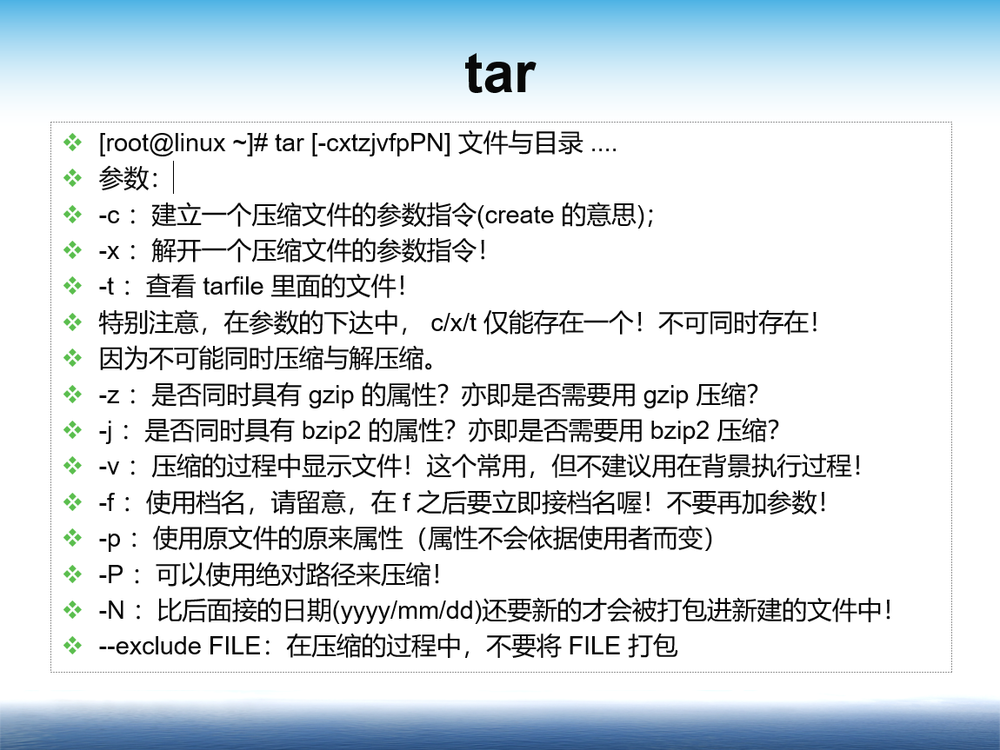
>
> 压缩：
>
> > tar -jcvf filename.tar.bz2 要被压缩的文件或目录名称
> >
> > tar -zcvf filename.tar.gz   要被压缩的文件或目录名称
>
> 查询：
>
> > tar -jtvf filename.tar.bz2
> >
> > tar -ztvf filename.tar.gz
>
> 解压缩：
>
> > tar -jxvf filename.tar.bz2 -C 欲解压缩的目录
> >
> > tar -zxvf filename.tar.gz -C 欲解压缩的目录

### 2.rpm软件包管理

#### 1.使用rpm查询虚拟光盘上的软件包

> `mkdir /mnt/cdrom`        #创建挂载点
>
> `mount   /dev/cdrom   /mnt/cdrom`#挂载光盘
>
> `cd   mnt/cdrom/Packages`
>
> `ls`

#### 2.使用rpm检索某个软件包是否已经安装

> rpm –q 程序名

### 3.yum软件包管理

#### 1.会使用yum在线安装软件，需要先配置网络

> cd /etc/sysconfig/network-scripts/	
>
> vi ifcfg-ens33 
>
> 把onboot   `no`改为`yes`
>
> service network restart	//重启网卡

#### 2.会使用yum安装光盘上的软件包

> yum -y install 软件名

## 10**vim程序编辑器**

### 1.工作模式

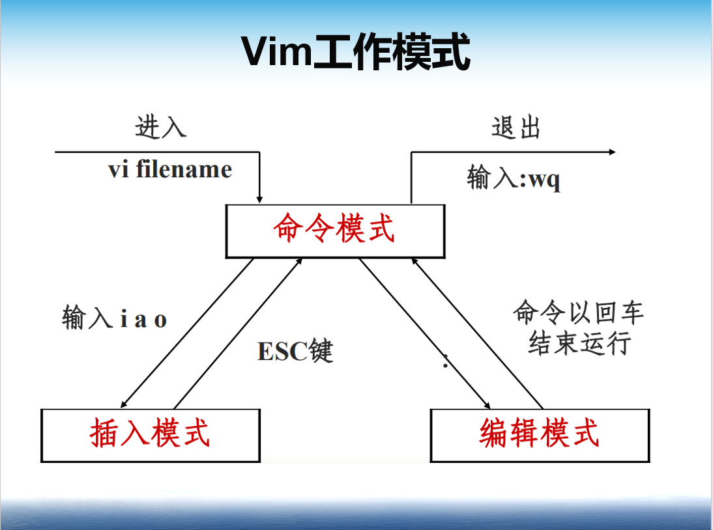

### 2.插入

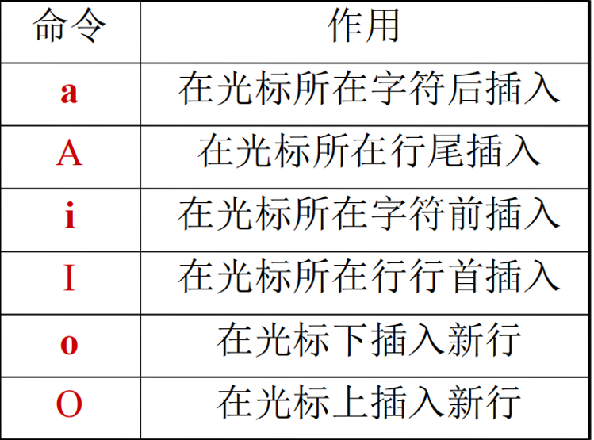

### 3.保存与退出：:wq!   不保存退出q!

## 11认识和学习bash

1. ####  什么是shell?shell的分类

   > Shell是一个命令行解释器，它为用户提供了一个向Linux内核发送请求以便运行程序的界面系统级程序，用户可以用Shell来启动、挂起、停止甚至是编写一些程序

   > `Bourne Shell`：从1979起Unix就开始使用Bourne Shell，Bourne Shell的主文件名为sh。
   >
   > `C Shell`： C Shell主要在BSD版的Unix系统中使用，其语法和C语言相类似而得名
   >
   > Shell的两种主要语法类型有Bourne和C，这两种语法彼此不兼容。Bourne家族主要包括`sh`、`ksh`、`Bash`、`psh`、`zsh`；C家族主要包括：`csh`、`tcsh`

2. #### 输入输出设备文件名以及文件描述符

   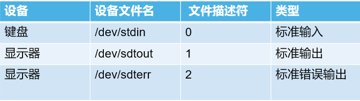

3. #### 输入输出重定向

   > wc [选项] [文件名]
   >
   > > 选项：
   > >
   > > -c 统计字节数
   > >
   > > -w 统计单词数
   > >
   > > -l 统计行数
   >
   
> 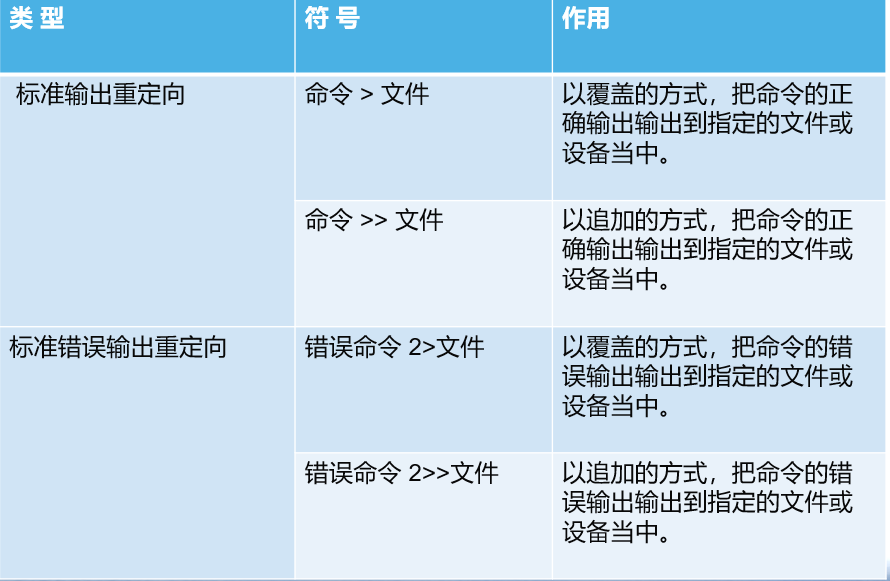
   
4. ####  <、<<

   > 命令<文件   把文件作为命令的输入
   >
   > 命令<< 标识符
   >
   >  …
   >
   > 标识符   把标识符之间内容作为命令的输入

5. ####  >、>>

   > **例一：**将目前目录下的档案信息全部储存到 list.txt 档案中
   >
   >  ls   -al   >   list.txt
   >
   > **例二：**将根目录下的数据也储存到 list.txt
   >
   >  ls   -al   /   >>  list.txt
   >
   > `>>`**为追加内容**

6. ####  2>、2>>

   > `2>` 是将错误输出到哪里
   > `2>>` 是将错误输出追加到哪里

7. #### &>、&>>

   > &>可以将错误信息或者普通信息都重定向输出
   >
   > &>>将错误信息或者普通信息都重定向追加输出
   >

## 13学习shell script

1. #### 创建脚本文件

   > `[root@localhost sh]# vi hello.sh`
   >
   > `#!/bin/Bash`
   >
   > `#The first program`
   >
   > `echo -e "Mr. Shen Chao is the most honest man in LampBrother”`

2. #### 运行脚本文件

   > 赋予执行权限，直接运行
   >
   >  `chmod 755 hello.sh`
   >
   > `./hello.sh` 
   >
   > 通过Bash调用执行脚本
   >
   > ` bash hello.sh`

3. #### Echo –e

4. #### Read-p

5. #### 判断用户名是否正确

6. #### 判断用户输入的是什么文件

   ```shell
   #!/bin/bash
   #判断用户输入的是什么文件
   # Author: shenchao （E-mail: shenchao@lampbrother.net）
   read -p "Please input a filename:
   " file
   #接收键盘的输入，并赋予变量file
   if [ -z "$file" ]
   #判断file变量是否为空
   then
    echo "Error,please input a filename"
    exit 1
   elif [ ! -e "$file" ]
   #判断file的值是否存在=
   then
    echo "Your input is not a file!"
    exit 2
   elif [ -f "$file" ]
   #判断file的值是否为普通文件
   then
    echo "$file is a regulare file!"
   elif [ -d "$file" ]
   #判断file的值是否为目录文件
   then
    echo "$file is a directory!"
   else
    echo "$file is an other file!"
   fi
   ```

7. #### 使用while求1~100累加

   ```shell
   [root@linux scripts]# vi sh03.sh
   s=0
   i=0
   while [ "$i" != "100" ]
   do
   i=$(($i+1))
   s=$(($s+$i))
   done
   echo "The result of '1+2+3+...+100' is ==> $s"
   ```

8. #### 使用for…in遍历某个目录下的文件

   

## 14Linux账号管理

1. ####  用户帐号：

   >  超级用户root(UID：0)
   >
   >  普通用户（UID：1000～60000）
   >
   >  系统用户(UID：1~499)

2. ####  组帐号：

   >  基本组(私有组)
   >
   >  附加组（公共组）

3. ####  UID和GID：

   >   UID（User Identity，用户标识号）
   >
   >   GID（Group Identify，组标识号）

4. #### id 用户名:可以查看用户的信息

   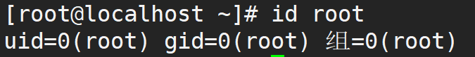

5. #### 知道这四个文件中都存储了什么信息

   > 用户信息文件/etc/passwd
   >
   > 影子文件/etc/shadow
   >
   > 组信息文件/etc/group
   >
   > 组密码文件/etc/gshadow

6. #### 掌握以下命令

   >  用户添加命令useradd
   >
   >  修改用户密码passwd
   >
   >  修改用户信息usermod
   >
   >  删除用户userdel
   >
   >  用户切换命令su
   >
   >  groupadd
   >
   >  groupmod
   >
   >   groupdel

7. #### 范例：创建一个用户lamp1,其权限为550 初始组为users，附加组为root 

   ```shell
   useradd -u 550 lamp1 -g users -G root 
   ```

8. #### 范例：将刚刚上个命令建立的 group1 名称改为 mygroup ， GID 为 201 

   ```shell
   groupmod -g 201 -n mygroup group1
   ```
