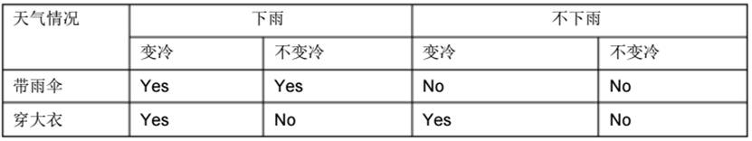

# 软件工程整理

---

## 第1章       软件工程学概述

1. ### *`什么是软件危机？软件危机有哪些典型表现？`*

   > 解释：在计算机软件的开发和维护过程中所遇到的一系列严重问题。

   > 表现：•1、对软件开发成本和进度的估计常常很不准确
   >
   > ​			•2、用户对“已完成的”软件系统不满意的现象经常发生
   >
   > ​			•3、软件产品的质量往往靠不住。
   >
   > ​			•4、软件常常是不可维护的。
   >
   > ​			•5、软件通常没有适当的文档资料。
   >
   > ​			•6、软件成本在计算机系统总成本中所占的比例逐年上升。
   >
   > ​			•7、软件开发生产率提高的速度，远远跟不上计算机应用迅速普及深入的趋势。

2. ### 什么是计算机软件？什么是软件工程？

   > **计算机软件**是由`程序，数据，文档`构成

   >  **软件工程**是指导计算机软件开发和维护的一门**工程学科**

3. ### 软件工程方法学包含哪几个要素？

   >  **方法、工具和过程**

4. ###  *`什么是软件的生命周期？由哪3个时期组成？由哪8个阶段构成？每个阶段的基本任务是什么？`*

   > 软件生命周期由**软件定义、软件开发和运行维护(软件维护)**3个时期组成
   >
   > 八个阶段：•1. 问题定义：**要解决的问题是什么**
   >
   > ​						•2. 可行性研究：**有可行的解吗**
   >
   > ​						•3. 需求分析：**必须做什么**
   >
   > ​						•4. 总体设计：**如何解决已提出的问题**
   >
   > ​						•5. 详细设计：**怎样具体实现该系统**
   >
   > ​						•6. 编码和单元测试：**得到正确的程序模块**
   >
   > ​						•7. 综合测试：**得到符合要求的软件**
   >
   > ​						•8. 软件维护：**使系统持久地满足用户的需要**

5. ###  *`软件维护通常分成几类？`*

   >  •**改正性维护**
   >
   > •**适应性维护**
   >
   > •**完善性维护**
   >
   > •**预防性维护**

6. ###  了解瀑布模型、快速原型、增量模型、螺旋模型、喷泉模型

##  第2章       可行性研究

1. ### 可行性研究阶段解决的主要问题

   > 就是用最小的代价在尽可能短得时间内确定问题是否能够解决

2. ###  *`重点掌握可行性研究的步骤`*

   > **复查系统的规模、目标和限制。**
   >
   > **研究正在使用的系统问题**
   >
   > **导出新系统的高层逻辑模型**
   >
   > **进一步定义问题**
   >
   > **导出和评价供选择的解决方案**
   >
   > **推荐行动方针**
   >
   > **草拟开发计划**
   >
   > **书写可行性研究报告，提交审查**

3. ### 从哪3方面进行可行性研究

   > •经济可行性
   >
   > •技术可行性
   >
   > •操作可行性

4. ### 掌握数据流图的画法

5. ### 什么是数据字典

   > 是对所有与系统相关的数据元素的一个有组织的**列表**，以及**精确的、严格的定义**，使用用户和系统分析员对于输入、输出、存储成分和中间计算有**共同的理解**。

6. ### 成本估计有哪些技术？

   > **代码行技术**
   >
   > **任务分解技术**
   >
   > **自动估计成本技术**

7. ### 成本/效益分析的方法

   > **货币的时间价值**
   >
   > **投资回收期**
   >
   > **纯收入**

##  第3章	需求分析

1. ### 需求分析阶段的基本任务

   > **1.确定软件系统的综合需求**
   >
   > **2.分析系统的数据需求**
   >
   > **3.导出系统的逻辑模型**
   >
   > **4.修正系统开发计划**
   >
   > **5.验证软件需求分析的正确性**
   >
   > **6.编写软件需求规格说明书**

2. ### 掌握实体-联系图的画法

3. ###  掌握ipo图的画法

## 第4章       总体设计

1. ### 总体设计的目的

   > 就是`系统应该如何实现这个问题`

2. ### *`软件设计过程应遵循基本原理包括哪5个方面？`*

   > **模块化**
   >
   > **抽象** 
   >
   > **逐步求精**
   >
   > **信息隐蔽和局部化**
   >
   > **模块独立**

3. ### *`什么是模块独立性？衡量模块独立性的指标`*

4. ### *`重点掌握耦合与内聚的概念和类型`*

   > **耦合性是对一个软件结构中不同模块之间互连程度的度量**

   > 数据耦合（数据通信）
   >
   > 特征耦合（使用相同的数据结构）
   >
   > 控制耦合（一方控制另一方）
   >
   > 公用耦合（涉及共同的数据区）
   >
   > 内容耦合（一方涉及另一方）
   >
   > 非直接耦合

   > **内聚是衡量一个模块内各个元素彼此结合的紧密程度。**

   > 功能内聚（函数内聚） 
   >
   > 顺序内聚（前一输出是下一个输入）
   >
   > 通信内聚（使用相同的输入和输出）     
   >
   > 过程内聚（受同一控制流支配）
   >
   > 时间内聚（动作与时间有关）
   >
   > 逻辑内聚（动作在逻辑上是有关）
   >
   > 偶然内聚（内聚度为零）

5. ### 开发软件的启发性规则

   > **改进软件结构提高模块的独立性**
   >
   > **模块规模应该适中**
   >
   > **深度、宽度、扇出和扇入都应适当**
   >
   > **模块的作用域应该在控制域之内**
   >
   > **力争降低模块接口的复杂程度**
   >
   > **设计单入口单出口的模块**
   >
   > **模块应该可以预测**

6. ### *`重点掌握宽度、深度、扇入、扇出`*

   > **深度：一个模块包括自身及其他模块的层数**
   >
   > **宽度：软件结构内同一个层次上的模块总数的最大值。**
   >
   > **扇出：一个模块直接控制(调用)的模块数目。**
   >
   > **扇入：有多少个上级模块直接调用它。**

7. ### 模块的作用域应在控制域之内，如果不在控制域内应如何解决？

   > **一个方法是把做判定的点往上移（减小作用域）**
   >
   > **另一个方法是把那些在作用域内但不在控制域内的模块移到控制域内（增加控制域）**

## 第5章       详细设计

1. ### 详细设计阶段的根本目标

   > **确定怎样具体地实现所要求的系统**

2. ### 结构化程序设计包含哪几种结构

   > - 顺序结构  
   >
   > - IF_THEN_ELSE型选择结构
   >
   > - DO_WHILE型循环结构

3. ### *`重点掌握流程图、盒图、pad图的画法`*

4. ### *`掌握判定树和判定表`*

## 第6章	实现

1. ### 实现主要做什么工作？

   > 实现指的是编码和测试

2. ### 软件测试的主要目标是什么？

   > 尽可能多的发现并排除软件中潜藏得错误。

3. ### *`什么是黑盒测试与白盒测试？`*

   > **不深入代码细节的测试方法称为黑盒测试。检查程序功能是否能按说明书的规定正常使用**

   > **白盒测试是根据程序内部逻辑结构进行的测试。检查程序中的主要执行通路是否按预定要求正确工作。**

4. ### *`软件测试的步骤？`*

   > （1）模块测试（单元测试）
   >
   > （2）子系统测试
   >
   > （3）系统测试
   >
   > （4）验收测试（确认测试）
   >
   > （5）平行运行

5. ### 集成测试中渐增式与非渐增式测试

   > 渐增式测试：**把下一个要测试的模块同已经测试好的那些模块结合起来进行测试。**
   >
   > 非渐增式测试：**一次就把所有通过了单元测试的模块组合在一起进行全程序的测试。**

## 综合题：

1. ### 画出下面用 PDL 写出的程序的 PAD 图和流程图（自己画）。

   ```c
   WHILE P DO 
   IF A >O THEN A1
   ELSE A2 ENDIF; 
   S1; 
   IF B>0 THEN 
   B1; 
   WHILE  C  DO 
   S1;
   S2;
   ENDWHILE; 
   ELSE
    B2 
   ENDIF; 
   B3 
   ENDWHILE;
   ```

   

2. ### 请用判定表画出以下问题的行为逻辑。 人们往往根据天气情况决定出门时的行装；天气可能下雨，也可能不下雨；天气可能变冷，也可能不变冷。如果天气要下雨，出门时带上雨伞；如果天气变冷，出门时要穿上大衣。

   