# 计算机网络应用大赛云平台部分

## 20190615国赛-福建福州

### A卷

> - CentOS使用最小安装
>
> > `ifconfig`命令使用[root@localhost ~]# `yum install net-tools`安装
>
> 配置本地yum源
>
> 挂载本地镜像`mount -o loop 映像名称路径 挂载路径` 挂载命令 
>
> 路径`/etc/yum.repos.d`
>
> - 更改`CentOS-Media.repo`文件
>
> > `[c7-media]
> > name=CentOS-$releasever - Media
> > baseurl=file:///mnt/cdrom/
> > gpgcheck=1
> > enabled=1
> > gpgkey=file:///etc/pki/rpm-gpg/RPM-GPG-KEY-CentOS-7`
>
> - 安装软件包
>
>   > [root@localhost ~]#`yum install -y httpd`
>   >
>   > [root@localhost ~]#`yum install -y mod_ssl`
>   >
>   > [root@localhost ~]#`yum install -y php`
>   >
>   > [root@localhost ~]#`yum install -y nfs-utils`
>   >
>   > [root@localhost ~]#`yum install -y bind`
>   >
>   > [root@localhost ~]#`yum install -y bind-utils`
>   >
>   > [root@localhost ~]#`yum install -y haproxy`
>   >
>   > [root@localhost ~]#`yum install -y mariadb-server`
>   >
>   > [root@localhost ~]#`yum install -y mariadb`
>
>  - `
>

> `static` 静态
>
> BOOTPROTO=static  
> IPADDR=192.168.0.11(改成要设置的IP)  
> NETMASK=255.255.255.0 (子网掩码)  
> GATEWAY=192.168.0.1(网关)  
> ONBOOT=yes  
> 然后  
> service network restart  
> 怕忘。。。  

> - 创建一个名为datastore的卷组，卷组的PE尺寸为8MB
>
>   [root@servera ~]# `vgcreate -s 8MB datastore /dev/sdb`
>
> 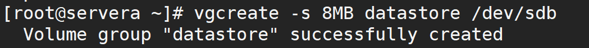
>
> - 逻辑卷的名称为database所属卷组为datastore，该逻辑卷大小为8G
>
>   [root@servera ~]# `lvcreate -L 8G -n database datastore`
>
> 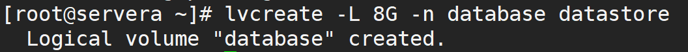
>
> - 将新建的逻辑卷database格式化为XFS文件系统，编辑/etc/fstab文件实现以UUID的形式将逻辑卷开机自动挂载至/data/web_data目录。
>
>   - 格式化[root@servera ~]# `mkfs -t xfs /dev/datastore/database`
>
>   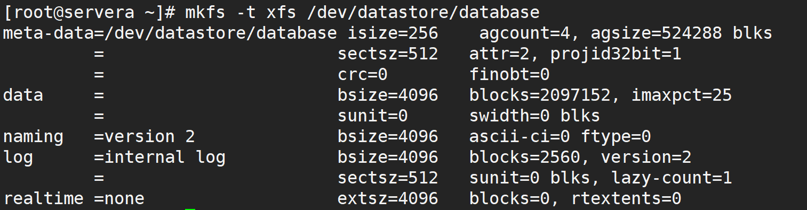
>
>   新建目录之后
>
>   - 挂载[root@servera web_data]#`mount /dev/datastore/database ./`
>
>   - 获得UUID[root@servera etc]# `blkid `
>
>   - 修改 /etc/fstab    [root@servera etc]# `vi fstab ` `
>     - 添加 UUID=2HhNR5-R66m-DClt-HVnH-n0t4-kjtK-7eRv6Y /data/web_data      xfs     defaults        0 0

> - 配置NFS
>
>  编辑exports文件，添加
>
> `vi /etc/exports`  
>
> `/data/web_data/ 192.168.100.10/24(rw,sync,fsid=0)`

> -  配置DNS服务
>
>   [root@servera etc]# `vi /etc/named.conf`
>
>   改为类似这样
>
>   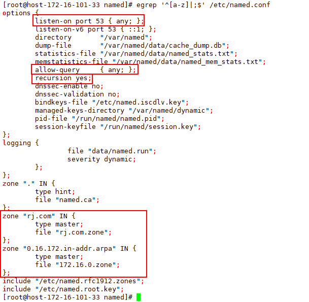

---

#### SDN部分

> - 先导入模板。
>
> - 系统登录的用户名/密码都是mininet
>
> > cd /etc/network
> >
> > cat interfaces
> >
> > ifup eth0
> >
> > sudo !!
>
> - 之后ping一下网关看是否可以ping通

> mininet@mininet-vm:~/$`cd ODL/bin`
>
> mininet@mininet-vm:~/ODL/bin$ `sudo ./karaf`
>
> 安装好之后效果
>
> 

> 依次安装要求安装的组件（直接复制粘贴就行）
>
> `feature:install odl-restconf`  
> `feature:install odl-l2switch-switch-ui`  
> `feature:install odl-mdsal-apidocs`  
> `feature:install odl-dluxapps-applications`  

> 现在已经可以使用网页登陆了
>
> 访问：`ip地址:8181/index.html`
>
> 账号密码为admin
>
> 

>- 构建拓扑
>
>  mininet@mininet-vm:~$ `sudo mn -c`清空原有拓扑
>
>  mininet@mininet-vm:~$ `sudo mn -help`查看可构建的模块
>
>  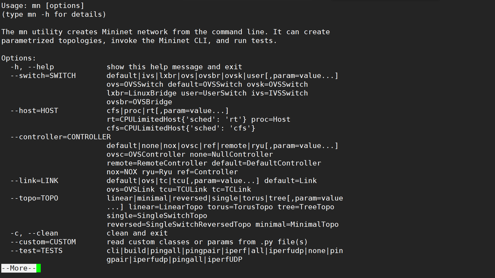
>
>  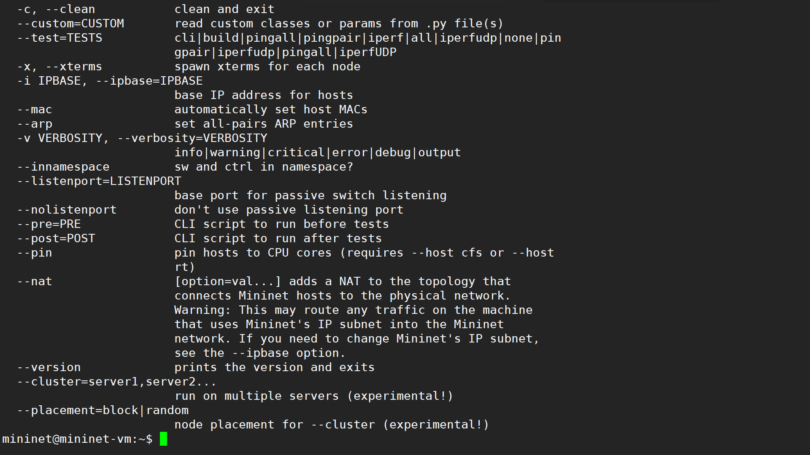

> mininet@mininet-vm:~$ `sudo mn --topo=single,3 --controller=remote,ip=127.0.0.1,port=6653`构建拓扑图
>
> mininet> `nodes`查看有哪些节点
>
> 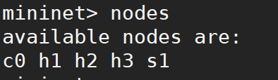
>
> mininet> `links`查看是如何连接的
>
> 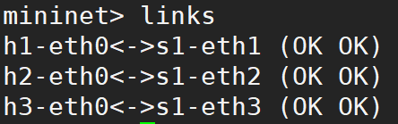
>
> mininet> `pingall`
>
> 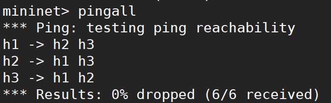
>
> - 拓扑图长这样
>
> 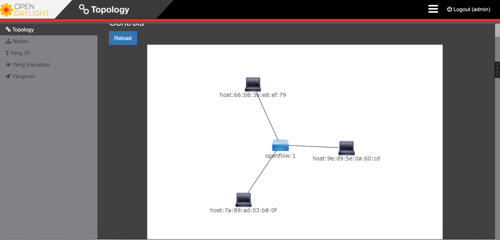

> 通过ovs下发流表
>
> mininet> `sh ovs-ofctl  add-flow s1 priority=100,in_port=2,actions=drop`
>
> mininet> `pingall`
>
> 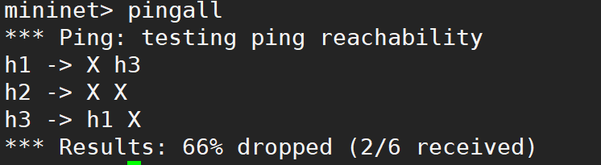
>
> 

> **H1启动HTTP-Server功能，WEB端口为8080，H3作为HTTP-Client，获取H1的html网页配置文件**
>
> > mininet> `h1 ifconfig`
> >
> > mininet> `h2 ifconfig`
> >
> > mininet> `h3 ifconfig`
> >
> > mininet> `h1 ping h3`
> >
> > mininet> `h1 python -m SimpleHTTPServer 8080 &`
> >
> > mininet> `h3 wget -o - http://10.0.0.1:8080`
> >
> > 测试时加着*-o*未成功

