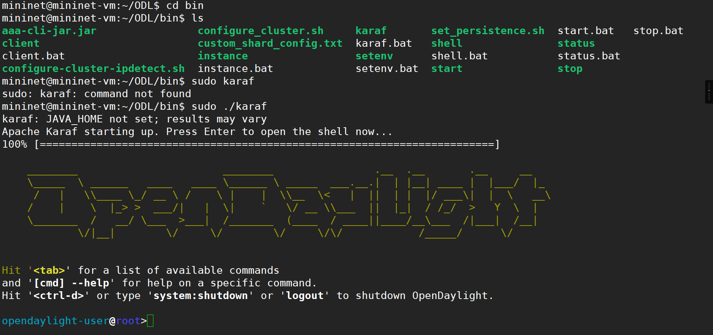
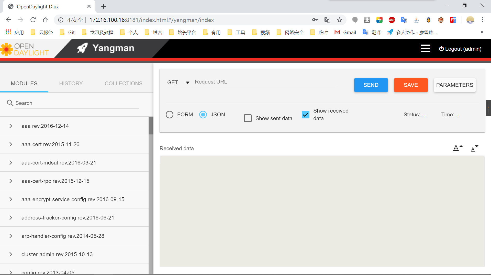

# 计算机网络应用大赛云平台部分

## 20190615国赛-福建福州

### A卷

#### SDN部分

> - 先导入模板。
>
> - 系统登录的用户名/密码都是mininet
>
> > cd /etc/network
> >
> > cat interfaces
> >
> > ifup eth0
> >
> > sudo !!
>
> - 之后ping一下网关看是否可以ping通

> mininet@mininet-vm:~/$`cd ODL/bin`
>
> mininet@mininet-vm:~/ODL/bin$ `sudo ./karaf`
>
> 安装好之后效果
>
> 

> 依次安装要求安装的组件（直接复制粘贴就行）
>
> `feature:install odl-restconf`
> `feature:install odl-l2switch-switch-ui`
> `feature:install odl-mdsal-apidocs`
> `feature:install odl-dluxapps-applications`

> 现在已经可以使用网页登陆了
>
> 访问：`ip地址:8181/index.html`
>
> 账号密码为admin
>
> 

----

### B卷

----
### C卷

---

### D卷

----
### E卷

---

### F卷

----

### G卷

---

### H卷

----

### I卷

---

### J卷
